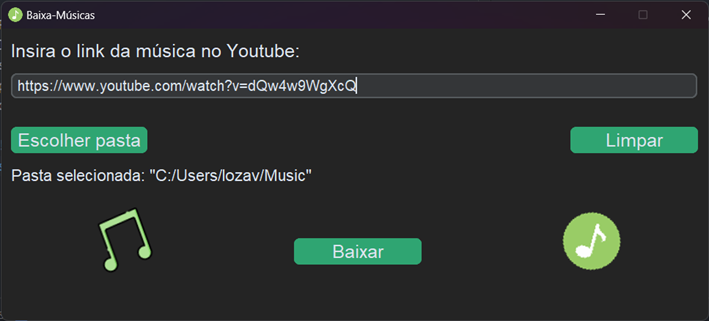
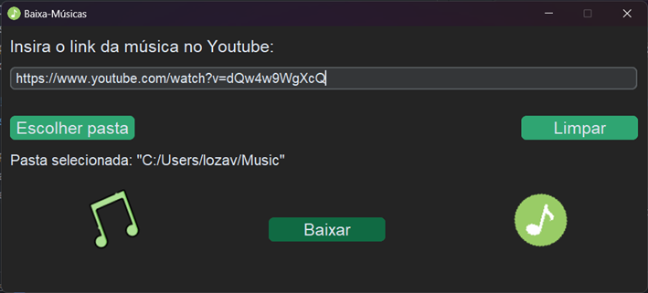
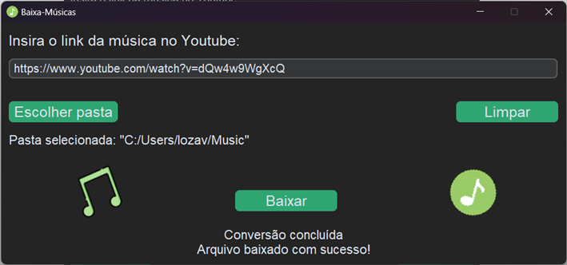

# Baixa-Músicas

Baixa-Músicas é um aplicativo desktop escrito em Python voltado para o download de músicas a partir de vídeos do Youtube.

## Guia de Instalação

Clone este repositório por meio do comando `git clone https://github.com/Lozavival/Baixa-Musicas.git` ou baixe o arquivo [.zip](baixa-musicas.zip).

Em seguida, dentro do diretório do projeto, instale as bibliotecas necessárias com o comando `pip install -r requirements.txt`, de preferência dentro de um ambiente virtual.

Além disso, são necessário dois pacotes externos para o funcionamento do programa: `python3-tk` e `ffmpeg`. Verifique se eles já estão instalados e, em caso negativo, instale-os.

Para executar o aplicativo, basta rodar o arquivo [src/app.py](src/app.py).

## Uso

Primeiro, acesse a música desejada no Youtube, copie o link do vídeo e cole na caixa de texto indicada. Em seguida, clique no botão "Escolher pasta" e selecione a pasta na qual você deseja que o vídeo seja baixado. Você deve obter um resultado similar ao mostrado abaixo:

Para baixar a música, clique no botão "Baixar". O botão assumirá um tom mais escuro de verde enquanto o download estiver em andamento, como na figura abaixo.

Após alguns instantes, o download será concluído e uma mensagem será exibida na tela indicando o sucesso ou falha da operação. Se o download ocorrer sem problemas, a seguinte mensagem será exibida: 

Caso ocorra algum problema no download, será exibida uma mensagem indicadora do erro:
- Se a mensagem "Falha na conversão, tente novamente!" aparecer, significa que algo deu errado durante a conversão de mp4 para mp3, ou seja, o problema ocasionou de um erro no programa.
- Qualquer outra mensagem que aparecer indicará uso incorreto por parte do usuário; nesse caso, corrija o problema e tente novamente.

## Disclaimer

Este programa foi desenvolvido com o objetivo de aprendizagem e treino das funcionalidades incluídas (download de vídeos do YouTube, conversão de mp4 para mp3 e desenvolvimento de interfaces gráficas). Não utilize esse software para adquirir conteúdos protegidos por copyright e/ou propriedades intelectuais de outrem. 

## Referência

["Baixando mp3 do Youtube com Python" - pycodebr](https://www.instagram.com/p/ChPoH-OsUoV/?igshid=MDJmNzVkMjY%3D)
